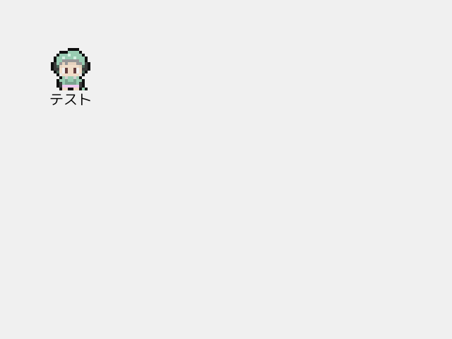

# Siv3D:シナリオは設定ファイルに

## はじめに
ゲームのストーリーはコードに記述したくない。
できるだけ設定ファイルに書いて、それを読みながら動いてほしい。

下のTOMLは簡単なストーリ上のイベントについて書いた例。
C++で「イベント(`event`)」だと他の概念と衝突しやすそうなので、以降は「シナリオ(`scenario`)」と呼ぶ

```toml
# 例 NPCに話しかけたときのシナリオ #
[[Scenario1]]
    push = "text"
    param = {entity="player", text="こんにちは"}
[[Scenario1]]
    push = "wait"
    param = 1.0
[[Scenario1]]
    push = "text"
    param = {entity="npc", text="こんにちは"}
[[Scenario1]]
    push = "text"
    param = {entity="npc", text="ついてきて"}
[[Scenario1]]
    push = "walk"
    param = {entity="npc", direction="right", length=100}
[[Scenario1]]
    push = "walk"
    param = {entity="npc", direction="down", length=100}
```

これを動かすためにはどんな設計が必要か、Siv3Dを書きながら考える。

## （１）文字列とゲーム内の物を紐づける
設定ファイルからは `entity="player"` のように文字列でゲーム内の物を指定する。
文字列でどんな物でも指定できる設計にしておきたい。

今回はECSのような考え方を採用してみる。
（ECS：Entity Component System, 実体（Entity）にデータ（Component）を付け外しする設計）
作るコンポーネントは3種類（座標、画像、テキスト）、
話を簡単に進めるために、名前をキーとするシンプルな `HashTable` で実装した。

```cpp
// 座標
struct PosComponent
{
	Vec3 pos; // {x,y}: 画面上の位置, z: 描画順
};

// 画像表示
struct ImageComponent
{
	Texture texture;
	Size imageSize; // 画像を切り分けるサイズ
	Point imagePos; // 表示する画像の番号
	bool isHidden = false; // true のとき非表示
};

// テキスト表示
struct TextComponent
{
	String text;
	Font font;
};

// EntityとComponentの管理
struct EntitySet
{
	// Entity名のセット
	HashSet<String> nameSet;

	// 名前 -> Component
	HashTable<String, PosComponent> posTable;
	HashTable<String, ImageComponent> imageTable;
	HashTable<String, TextComponent> textTable;

	// Entityの削除
	void erase(const String& name)
	{
		nameSet.erase(name);
		posTable.erase(name);
		imageTable.erase(name);
		textTable.erase(name);
	}
};
```

<details>
<summary> 画像とテキストを表示してみる。 </summary>

Entityを1つ描画する関数を用意
```cpp
void drawEntity(const EntitySet& entities, const String& name)
{
	if (not entities.posTable.count(name)) { return; }
	const auto& posC = entities.posTable.at(name);

	// 画像の表示
	if (entities.imageTable.count(name))
	{
		const auto& imageC = entities.imageTable.at(name);
		if (not imageC.isHidden)
		{
			imageC.texture(imageC.imagePos * imageC.imageSize, imageC.imageSize).drawAt(posC.pos.xy());
		}
	}

	// テキストの表示
	if (entities.textTable.count(name))
	{
		const auto& textC = entities.textTable.at(name);
		textC.font(textC.text).drawAt(posC.pos.xy(), Palette::Black);
	}
}
```

複数のEntityをz座標順で描画する関数を用意
```cpp
void drawEntities(const EntitySet& entities)
{
	Array<std::pair<double, String>> drawList;
	for (const auto& name : entities.nameSet)
	{
		if (entities.posTable.count(name))
		{
			const auto& posC = entities.posTable.at(name);
			drawList.emplace_back(posC.pos.z, name);
		}
	}
	std::sort(drawList.begin(), drawList.end());

	for (const auto& [z, name] : drawList)
	{
		drawEntity(entities, name);
	}
}
```

Player画像とテキストのEntityを追加して描画
```cpp
void Main()
{
	Window::Resize(Size{ 640, 480 });
	Scene::SetBackground(Color(0xf0));

	EntitySet entities;

	{ // Playerを追加
		const String name = U"Player";
		entities.nameSet.insert(name);
		entities.posTable[name] = { Vec3{100, 100, 0} };
		entities.imageTable[name] = {
			Texture{ U"siv3Dkun.png" },
			Size{80, 80},
			Point{0, 0}
		};
	}

	{ // テキストを追加
		const String name = U"text";
		entities.nameSet.insert(name);
		entities.posTable[name] = { Vec3{ 100, 140, 1 } };
		entities.textTable[name] = { U"テスト", Font{ 20 } };
	}

	while (System::Update())
	{
		drawEntities(entities);
	}
}
```



</details>

## （２）ゲームの状態をスタックで持つ
やりたいことを整理する。

* ゲームの状態を管理、遷移させながらゲームを進行させる
  * -> **Stateパターンを使う**
* 設定ファイルを読んでイベントを進行させる `State` がほしい
  * -> **`ScenarioState` を作る**
  * scenario.tomlというファイルを読みながら他の `State` を呼びだす
* 別の状態に遷移した後も `ScenarioState` に戻って続きを進めたい
  * -> **`State` をスタックで管理する**
  * popで一つ前に容易に戻れる
  * スタック内の `State` は進行状況を保持したまま
  * `ScenarioState` 以外の箇所でもスタックの方が都合がいいことが多い

---

まずは `State` 抽象クラスを作る。
Entityを操作できる関数を用意して、`update` の戻り値はスタック操作 `Action` を返す。

```cpp
class State
{
public:
	struct Action
	{
		enum class Type
		{
			NONE,
			POP,
			PUSH,
			REPLACE, // clear + push
		};

		Type type;
		std::unique_ptr<State> nextState;

		static Action None() { return { Type::NONE, nullptr }; }
		static Action Pop() { return{ Type::POP, nullptr }; }
		static Action Push(std::unique_ptr<State>&& state) { return{ Type::PUSH, std::move(state) }; }
		static Action Replace(std::unique_ptr<State>&& state) { return{ Type::REPLACE, std::move(state) }; }
	};

	virtual ~State() = default;

	virtual void onAfterPush(EntitySet& entities) = 0;
	virtual Action update(EntitySet& entities) = 0;
	virtual void onBeforePop(EntitySet& entities) = 0;
};
```

次に `State` をスタック形式で管理する `StateStack` クラスを作る。

```cpp
class StateStack
{
public:
	StateStack();
	void update(EntitySet& entities);

private:
	void pop(EntitySet& entities);
	void push(EntitySet& entities, std::unique_ptr<State>&& nextState);

	// top以外のデータも見たいのでArrayで実装
	// 末尾以外のデータを編集しないように気を付ける
	Array<std::unique_ptr<State>> m_stack;
};
```

```cpp
StateStack::StateStack()
{
	// TODO: 初期Stateをpush
	// m_stack.push_back(std::make_unique<ScenarioState>(U"init"));
}

void StateStack::update(EntitySet& entities)
{
	if (m_stack.empty()) { return; }

	// Stateの更新して、スタック操作を取得
	auto [type, nextState] = m_stack.back()->update(entities);

	switch (type)
	{
	case State::Action::Type::NONE:
		break;

	case State::Action::Type::POP:
		pop(entities);
		break;

	case State::Action::Type::PUSH:
		push(entities, std::move(nextState));
		break;

	case State::Action::Type::REPLACE:
		while (not m_stack.empty()) { pop(entities); }
		push(entities, std::move(nextState));
		break;
	}
}

void StateStack::pop(EntitySet& entities)
{
	m_stack.back()->onBeforePop(entities);
	m_stack.pop_back();
}

void StateStack::push(EntitySet& entities, std::unique_ptr<State>&& nextState)
{
	m_stack.push_back(std::move(nextState));
	m_stack.back()->onAfterPush(entities);
}
```

設定ファイル(scenario.toml)を読む `ScenarioState` を作って以下の機能を持たせる。

* Entityを作ることができる
	* pop時には作成したEntityを削除する
* scenario.tomlを読み込む
	* 指定した `TableArray` を順に読む
	* `make` でEntity作成
	* `push=` `replace=` で他Stateを作ってスタックに入れる

```cpp
class ScenarioState : public State
{
public:
	using MakeStateFunc
		= std::function<std::unique_ptr<State>(const TOMLValue&)>;

	ScenarioState(const String& scenarioName);
	ScenarioState(const TOMLValue& param);

	void onAfterPush(EntitySet& entities) override;
	Action update(EntitySet& entities) override;
	void onBeforePop(EntitySet& entities) override;

private:
	void makeEntities(EntitySet& entities, const TOMLValue& params);

	template<typename Type>
	MakeStateFunc makeStateFunc()
	{
		return [](const TOMLValue& param) {
			return std::make_unique<Type>(param);
		};
	}

	// シナリオ管理
	TOMLTableArrayIterator m_now;
	TOMLTableArrayIterator m_end;

	// ここで作ったEntityの名前（pop時に削除する用）
	HashSet<String> m_nameSetMadeOnThis;
};
```

```cpp
ScenarioState::ScenarioState(const String& scenarioName)
{
	static const TOMLReader reader{ U"scenario.toml" };
	m_now = reader[scenarioName].tableArrayView().begin();
	m_end = reader[scenarioName].tableArrayView().end();
}

ScenarioState::ScenarioState(const TOMLValue& param)
	: ScenarioState{ param.getString() }
{
}

void ScenarioState::onAfterPush(EntitySet&)
{
}

State::Action ScenarioState::update(EntitySet& entities)
{
	// 最後まで読んだら pop
	if (m_now == m_end) { return Action::Pop(); }

	static const HashTable<String, MakeStateFunc> MAKE_TABLE = {
		{ U"scenario", makeStateFunc<ScenarioState>() },
		// TODO: 他のStateもここに登録
	};

	const auto& nowToml = *m_now;
	++m_now;

	if (nowToml[U"make"].isTableArray())
	{
		// Entity作成
		makeEntities(entities, nowToml[U"make"]);
		return Action::None();
	}

	if (nowToml[U"push"].isString())
	{
		// push
		const String stateName = nowToml[U"push"].getString();
		return Action::Push(MAKE_TABLE.at(stateName)(nowToml[U"param"]));
	}

	if (nowToml[U"replace"].isString())
	{
		// replace
		const String stateName = nowToml[U"replace"].getString();
		return Action::Replace(MAKE_TABLE.at(stateName)(nowToml[U"param"]));
	}

	return Action::None();
}

void ScenarioState::onBeforePop(EntitySet& entities)
{
	for (const auto& name : m_nameSetMadeOnThis)
	{
		entities.erase(name);
	}
}

void ScenarioState::makeEntities(EntitySet& entities, const TOMLValue& params)
{
	for (const auto& param : params.tableArrayView())
	{
		const String name = param[U"name"].getString();
		entities.nameSet.insert(name);
		m_nameSetMadeOnThis.insert(name);

		if (param[U"pos"].isTable())
		{
			TOMLValue pos = param[U"pos"];
			entities.posTable[name] = {
				Vec3{
					pos[U"x"].get<double>(),
					pos[U"y"].get<double>(),
					pos[U"z"].get<double>(),
				}
			};
		}

		if (param[U"image"].isTable())
		{
			TOMLValue image = param[U"image"];
			entities.imageTable[name] = {
				Texture{ image[U"path"].getString() },
				Size{
					image[U"size.x"].get<int32>(),
					image[U"size.y"].get<int32>(),
				},
				Point{
					image[U"pos.x"].get<int32>(),
					image[U"pos.y"].get<int32>(),
				},
				image[U"isHidden"].getOr<bool>(false),
			};
		}

		if (param[U"text"].isTable())
		{
			TOMLValue text = param[U"text"];
			entities.textTable[name] = {
				text[U"text"].getString(),
				Font{ text[U"font.size"].get<int32>() },
			};
		}
	}
}
```

<details>
<summary> scenario.tomlを読み込んで、Entityを作るところまでやってみる </summary>

Main関数にStackSetを追加

```cpp
void Main()
{
	Window::Resize(Size{ 640, 480 });
	Scene::SetBackground(Color(0xf0));

	EntitySet entities;
	StateStack stateStack; // 追加

	while (System::Update())
	{
		stateStack.update(entities); // 追加
		drawEntities(entities);
	}
}
```

StateStackの初期Stateを設定して、`[[init]]` を読ませる。

```cpp
StateStack::StateStack()
{
	m_stack.push_back(std::make_unique<ScenarioState>(U"init"));
}
```

一瞬でpopされないように、ちょっと書き換える

```cpp
State::Action ScenarioState::update(EntitySet& entities)
{
	// 最後まで読んだら pop
	// if (m_now == m_end) { return Action::Pop(); } // <-- 一時的にコメントアウト
	if (m_now == m_end) { return Action::None(); } // <-- 最後まで読んだらストップ 

	// 略
}
```

scenario.tomlを準備

```toml
[[init]]
    [[init.make]]
        name = "player"
        pos = {x=100, y=100, z=0}
        image = {path="siv3Dkun.png", size={x=80,y=80}, pos={x=0, y=0}}
    [[init.make]]
        name = "text"
        pos = {x=100, y=140, z=1}
        text = {text="テスト", font={size=20}}
```

同じように画像とテキストを表示できる


</details>


他のStateも作る

<details>
<summary> WaitState（指定した秒数待つ） </summary>

```toml
[[Scenario]]
	push = "wait"
	param = {time=1.0}
```

```cpp
class WaitState : public State
{
public:
	WaitState(const TOMLValue& param);

	void onAfterPush(EntitySet& entities) override;
	Action update(EntitySet& entities) override;
	void onBeforePop(EntitySet& entities) override;

private:
	double m_time;
};
```

```cpp
WaitState::WaitState(const TOMLValue& param)
	: m_time{ param.get<double>() }
{
}

void WaitState::onAfterPush(EntitySet&)
{
}

State::Action WaitState::update(EntitySet&)
{
	m_time -= Scene::DeltaTime();
	return m_time < 0 ? Action::Pop() : Action::None();
}

void WaitState::onBeforePop(EntitySet&)
{
}
```

</details>

<details>
<summary> SpeakState（Entityの近くにテキストを出す） </summary>

```toml
[[Scenario]]
    push = "speak"
    param = {entity="player", text="こんにちは", offset={y=-45}}
```

```cpp
class SpeakState : public State
{
public:
	SpeakState(const TOMLValue& param);

	void onAfterPush(EntitySet& entities) override;
	Action update(EntitySet& entities) override;
	void onBeforePop(EntitySet& entities) override;

private:
	const String m_entityName;
	const String m_text;
	const Vec2 m_offset;
};
```

```cpp
SpeakState::SpeakState(const TOMLValue& param)
	: m_entityName{ param[U"entity"].getString() }
	, m_text{ param[U"text"].getString() }
	, m_offset{
		param[U"offset.x"].getOr<double>(0.0),
		param[U"offset.y"].getOr<double>(0.0)
	}
{
}

void SpeakState::onAfterPush(EntitySet& entities)
{
	const auto& entityPosC = entities.posTable.at(m_entityName);

	const String name = m_entityName + U"_speak";
	entities.nameSet.insert(name);
	entities.posTable[name] = {
		Vec3{
			entityPosC.pos.x + m_offset.x,
			entityPosC.pos.y + m_offset.y,
			1.0
		}
	};
	entities.textTable[name] = {
		m_text,
		Font{ 20 },
	};
}

State::Action SpeakState::update(EntitySet& entities)
{
	if (KeySpace.down())
	{
		return Action::Pop(); // 決定キーで終了
	}
	return Action::None();
}

void SpeakState::onBeforePop(EntitySet& entities)
{
	entities.erase(m_entityName + U"_speak");
}
```

</details>

## この設計のメリット

開発効率を上げる

* 軽微な修正（セリフの誤字など）のために毎回コンパイルし直す必要がなくなった
* `[[init]]` を書き換えるだけでテストしたい特定のシナリオへ飛べる
	* ゲームの最初から手順を追う必要がない（毎回タイトル画面を見なくてもいい）

ロジックとデータの分離

* シナリオのようなゲームデータと、ゲームを動かすロジックを分離できる
* セリフや細かい進行の記述でコードが汚れない
* 複数人で開発するときライターとプログラマーでの分業がしやすい
    * ライターはコードを直接書き換える必要はなく、scenario.tomlだけ触ってもらえばいい

状態管理の簡潔化

* ゲームの状態遷移の大半は「１つ前に戻る」
	* 「ポーズ→ポーズ解除(pop)」「メニュー画面で１つ前の画面へ(pop)」
	* これを `return Action::Pop()` を書くだけで実現できるので楽
* waitの後はspeakかwalkかといった次の処理を全て `ScenarioState` で管理できる
	* `WaitState` は遷移先を気にせずpopだけすればよい

再利用性が上がる

* `WaitState` などの汎用性が高いStateを作り、シナリオでそれを組み合わせる
* 作ったStateを別シナリオでも使いまわせる

## 記事にするために実装を簡略化した箇所（実際の開発に向けた課題）

命名の明確化

* 課題：
	* `State` は他機能と衝突する可能性が高い
* 対策案：
	* `GameState` 等もう少し具体的な名前をつける
	* `namespace` を使う

ECS周りの拡張性

* 課題：
	* 記事ではComponentを3種類に限定しているのでシンプルな設計でも成立している
	* 10種類あたりからパフォーマンスやメンテナンス性で破綻しはじめる可能性が高まる
* 対策案：
	* より本格的なECS設計を行う
	* EnTTなどの外部ECSライブラリも検討してみる

バリデーションチェックの早期実行

* 課題：
	* 実際にそのシナリオを実行するまでscenario.tomlの記載ミスに気づけないことが多い
* 対策案：
	* 起動時にscenario.tomlを読み込み、必須項目の有無などをチェックする
	* 事前に `TOMLValue` から各Stateコンストラクタ引数用の構造体を作り、変換時に型チェックなどを行う

動的なチェックとエラー処理

* 課題：
	* 各 `State` で指定されたEntityや必要なComponentが見つからなかったときの処理が未定義
* 対策案：
	* エラーを出すのかスキップするのか、それをparamで決められるようにするのか、など決めて動かす
	* 開発段階ではログなどを出し何故見つからないのかが追えるようにしておく

設定ファイルの書き方

* 課題：
	* シナリオが長いゲームでは `scenario.toml` の行数が膨大になる
	* 短く楽に書け、シナリオが探しやすく読みやすい状態でないと開発が長期化する
* 対策案：
	* 多用するStateのパラメータは少なく短く
	* 複数ファイルに分けられるようにしてみる
	* 書き方のドキュメント化
		* Stateごとに必須/オプションのパラメータ、型、説明などを整理する
	* そもそもTOMLはシナリオ書くのに向いていない？
		* 毎回 `[[Scenario]]` を書くのが面倒で、他シナリオへのコピペもしづらい
		* `[[Scenario.make.HogeComponent]]` のような書き方が面倒
		* Siv3Dが対応している設定ファイルの中では一番マシには思える

## 余談
「一ノ一」というゲームを開発中です。
ストアページ：link

今回の記事はこのゲーム制作中の挑戦と反省から作りました。
よければウィッシュリスト登録お願いします。

## おわりに
初めて記事作りをしました。

ゲーム制作で他人のコードを見る機会があまりなく、ほぼ独学でやっているので、
何かずれたことを書いてしまっていたらご指摘いただけるとありがたいです。
