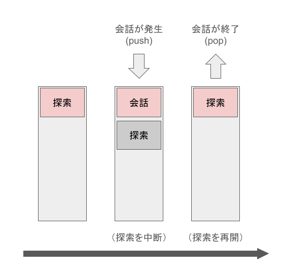
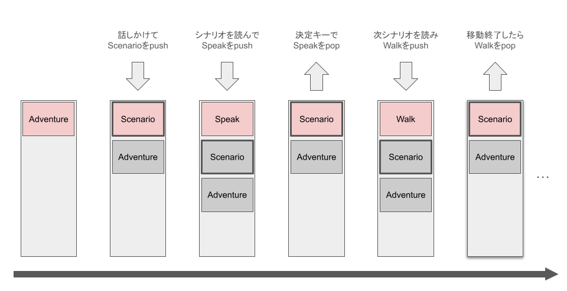

# Siv3D:シナリオは設定ファイルに

## はじめに
Siv3Dで以下のようなゲームを作ってみる。

（ここに動画を入れる）

---

セリフなどのゲームデータはコードに記述せず、設定ファイルに置きたい。

```toml
[[Scenario]]
    push = "speak"
    param = {entity="player", text="こんにちは", offset={y=-60}}
[[Scenario]]
    push = "wait"
    param = 0.5
[[Scenario]]
    push = "speak"
    param = {entity="npc", text="...", offset={y=-60}}
[[Scenario]]
    push = "walk"
    param = {entity="npc", to=450, speed=40}
[[Scenario]]
    push = "anim"
    param = {entity="npc", imagePos={x=1, y=0}}
```

上のTOMLは簡単なシナリオ（この記事では「ゲーム内で発生するイベントの流れを書いたもの」のような意味で使う）について書いた例。
これを動かすためにはどんな設計が必要か考える。

## （１）文字列とゲーム内の物を紐づける
シナリオでは `entity="player"` のように文字列でゲーム内の物を指定する。

今回はECSの考え方を採用してみる。
（ECS：Entity Component System, 実体（Entity）にデータ（Component）を付け外しする設計）

作るコンポーネントは3種類（座標、画像、テキスト）、
話を簡単に進めるためにEntity名をキーとするシンプルな `HashTable` で実装した。

```cpp
// 座標
struct PosComponent
{
	Vec3 pos; // {x,y}: 画面上の位置, z: 描画順
};

// 画像表示
struct ImageComponent
{
	Texture texture;
	Size imageSize; // 画像を切り分けるサイズ
	Point imagePos; // 表示する画像の番号
	bool isHidden = false; // true のとき非表示
};

// テキスト表示
struct TextComponent
{
	String text;
	Font font;
};

// EntityとComponentの管理
struct EntitySet
{
	// Entity名のセット
	HashSet<String> nameSet;

	// 名前 -> Component
	HashTable<String, PosComponent> posTable;
	HashTable<String, ImageComponent> imageTable;
	HashTable<String, TextComponent> textTable;

	// Entityの削除
	void erase(const String& name)
	{
		nameSet.erase(name);
		posTable.erase(name);
		imageTable.erase(name);
		textTable.erase(name);
	}
};
```

<details>
<summary> 画像とテキストを表示してみる。 </summary>

Entityを1つ描画する関数を用意
```cpp
void drawEntity(const EntitySet& entities, const String& name)
{
	if (not entities.posTable.count(name)) { return; }
	const auto& posC = entities.posTable.at(name);

	// 画像の表示
	if (entities.imageTable.count(name))
	{
		const auto& imageC = entities.imageTable.at(name);
		if (not imageC.isHidden)
		{
			imageC.texture(imageC.imagePos * imageC.imageSize, imageC.imageSize).drawAt(posC.pos.xy());
		}
	}

	// テキストの表示
	if (entities.textTable.count(name))
	{
		const auto& textC = entities.textTable.at(name);
		textC.font(textC.text).drawAt(posC.pos.xy(), Palette::Black);
	}
}
```

複数のEntityをz座標順で描画する関数を用意
```cpp
void drawEntities(const EntitySet& entities)
{
	Array<std::pair<double, String>> drawList;
	for (const auto& name : entities.nameSet)
	{
		if (entities.posTable.count(name))
		{
			const auto& posC = entities.posTable.at(name);
			drawList.emplace_back(posC.pos.z, name);
		}
	}
	std::sort(drawList.begin(), drawList.end());

	for (const auto& [z, name] : drawList)
	{
		drawEntity(entities, name);
	}
}
```

Player画像とテキストのEntityを追加して描画
```cpp
void Main()
{
	Window::Resize(Size{ 640, 480 });
	Scene::SetBackground(Color(0xf0));

	EntitySet entities;

	{ // Playerを追加
		const String name = U"Player";
		entities.nameSet.insert(name);
		entities.posTable[name] = { Vec3{100, 100, 0} };
		entities.imageTable[name] = {
			Texture{ U"siv3Dkun.png" },
			Size{80, 80},
			Point{0, 0}
		};
	}

	{ // テキストを追加
		const String name = U"text";
		entities.nameSet.insert(name);
		entities.posTable[name] = { Vec3{ 100, 140, 1 } };
		entities.textTable[name] = { U"テスト", Font{ 20 } };
	}

	while (System::Update())
	{
		drawEntities(entities);
	}
}
```


</details>

## （２）ゲームの状態をスタックで持つ
「プレイヤーが操作して探索」「NPCとの会話」「メニュー画面を操作」などなど、
ゲームには複数の状態があり、これをStateパターンを使って実装する。
（Stateパターン：状態に応じて振る舞いを変えるためのデザインパターン）

ゲームの状態遷移の大半は「１つ前の状態に戻る」なので、
（例：「探索中に会話が発生→終了したら探索に戻る」「メニュー画面で前のページに戻る」）
Stateをスタックで管理し、一番上を参照する。
pushは新しい状態への遷移、popは前の状態に戻る遷移となる。



---

まずは `State` 抽象クラスを作る。
Entityを操作できる関数を用意して、`update` の戻り値はスタック操作 `Action` を返す。

```cpp
class State
{
public:
	struct Action
	{
		enum class Type
		{
			NONE,
			POP,
			PUSH,
			RESET, // clear + push
		};

		Type type;
		std::unique_ptr<State> nextState;

		static Action None() { return { Type::NONE, nullptr }; }
		static Action Pop() { return{ Type::POP, nullptr }; }
		static Action Push(std::unique_ptr<State>&& state) { return{ Type::PUSH, std::move(state) }; }
		static Action Reset(std::unique_ptr<State>&& state) { return{ Type::RESET, std::move(state) }; }
	};

	virtual ~State() = default;

	virtual void onAfterPush(EntitySet& entities) = 0;
	virtual Action update(EntitySet& entities) = 0;
	virtual void onBeforePop(EntitySet& entities) = 0;
};
```

次に `State` をスタック形式で管理する `StateStack` クラスを作る。

```cpp
class StateStack
{
public:
	StateStack();
	void update(EntitySet& entities);

private:
	void pop(EntitySet& entities);
	void push(EntitySet& entities, std::unique_ptr<State>&& nextState);

	// top以外のデータも見たいのでArrayで実装
	// 末尾以外のデータを編集しないように気を付ける
	Array<std::unique_ptr<State>> m_stack;
};
```

```cpp
StateStack::StateStack()
{
	// TODO: 初期Stateを登録
}

void StateStack::update(EntitySet& entities)
{
	if (m_stack.empty()) { return; }

	// Stateの更新して、スタック操作を取得
	auto [type, nextState] = m_stack.back()->update(entities);

	switch (type)
	{
	case State::Action::Type::NONE:
		break;

	case State::Action::Type::POP:
		pop(entities);
		break;

	case State::Action::Type::PUSH:
		push(entities, std::move(nextState));
		break;

	case State::Action::Type::RESET:
		while (not m_stack.empty()) { pop(entities); }
		push(entities, std::move(nextState));
		break;
	}
}

void StateStack::pop(EntitySet& entities)
{
	m_stack.back()->onBeforePop(entities);
	m_stack.pop_back();
}

void StateStack::push(EntitySet& entities, std::unique_ptr<State>&& nextState)
{
	m_stack.push_back(std::move(nextState));
	m_stack.back()->onAfterPush(entities);
}
```

## （３）シナリオを処理する
`ScenarioState` を作り、シナリオのファイル（scenario.toml）を読ませてEntityやStateの作成を行う。
他状態への遷移は基本的にpushで行うので、popでScenarioStateに戻ればシナリオが再開する。



```toml
[[Scenario]]
	[[Scenario.make]] # entityの追加
		name = "npc"
        pos = {x=360, y=340, z=0}
        image = {path="npc.png", size={x=80, y=80}, pos={x=1, y=0}}

[[Talk]]
    push = "speak"
    param = {entity="npc", text="...", offset={y=-60}}
[[Talk]]
    push = "walk"
    param = {entity="npc", to=450, speed=40}
```

```cpp
class ScenarioState : public State
{
public:
	using MakeStateFunc
		= std::function<std::unique_ptr<State>(const TOMLValue&)>;

	ScenarioState(const String& scenarioName);
	ScenarioState(const TOMLValue& param);

	void onAfterPush(EntitySet& entities) override;
	Action update(EntitySet& entities) override;
	void onBeforePop(EntitySet& entities) override;

private:
	void makeEntities(EntitySet& entities, const TOMLValue& params);

	template<typename Type>
	MakeStateFunc makeStateFunc()
	{
		return [](const TOMLValue& param) {
			return std::make_unique<Type>(param);
		};
	}

	// シナリオ管理
	TOMLTableArrayIterator m_now;
	TOMLTableArrayIterator m_end;

	// ここで作ったEntityの名前（pop時に削除する用）
	HashSet<String> m_nameSetMadeOnThis;
};
```

```cpp
ScenarioState::ScenarioState(const String& scenarioName)
{
	static const TOMLReader reader{ U"scenario.toml" };
	m_now = reader[scenarioName].tableArrayView().begin();
	m_end = reader[scenarioName].tableArrayView().end();
}

ScenarioState::ScenarioState(const TOMLValue& param)
	: ScenarioState{ param.getString() }
{
}

void ScenarioState::onAfterPush(EntitySet&)
{
}

State::Action ScenarioState::update(EntitySet& entities)
{
	// 最後まで読んだら pop
	if (m_now == m_end) { return Action::Pop(); }

	static const HashTable<String, MakeStateFunc> MAKE_TABLE = {
		{ U"scenario", makeStateFunc<ScenarioState>() },
		// TODO: 他のStateもここに登録
	};

	const auto& nowToml = *m_now;
	++m_now;

	if (nowToml[U"make"].isTableArray())
	{
		// Entity作成
		makeEntities(entities, nowToml[U"make"]);
		return Action::None();
	}

	if (nowToml[U"push"].isString())
	{
		// push
		const String stateName = nowToml[U"push"].getString();
		return Action::Push(MAKE_TABLE.at(stateName)(nowToml[U"param"]));
	}

	if (nowToml[U"reset"].isString())
	{
		// reset
		const String stateName = nowToml[U"reset"].getString();
		return Action::Reset(MAKE_TABLE.at(stateName)(nowToml[U"param"]));
	}

	return Action::None();
}

void ScenarioState::onBeforePop(EntitySet& entities)
{
	for (const auto& name : m_nameSetMadeOnThis)
	{
		entities.erase(name);
	}
}

void ScenarioState::makeEntities(EntitySet& entities, const TOMLValue& params)
{
	for (const auto& param : params.tableArrayView())
	{
		const String name = param[U"name"].getString();
		entities.nameSet.insert(name);
		m_nameSetMadeOnThis.insert(name);

		if (param[U"pos"].isTable())
		{
			TOMLValue pos = param[U"pos"];
			entities.posTable[name] = {
				Vec3{
					pos[U"x"].get<double>(),
					pos[U"y"].get<double>(),
					pos[U"z"].get<double>(),
				}
			};
		}

		if (param[U"image"].isTable())
		{
			TOMLValue image = param[U"image"];
			entities.imageTable[name] = {
				Texture{ image[U"path"].getString() },
				Size{
					image[U"size.x"].get<int32>(),
					image[U"size.y"].get<int32>(),
				},
				Point{
					image[U"pos.x"].get<int32>(),
					image[U"pos.y"].get<int32>(),
				},
				image[U"isHidden"].getOr<bool>(false),
			};
		}

		if (param[U"text"].isTable())
		{
			TOMLValue text = param[U"text"];
			entities.textTable[name] = {
				text[U"text"].getString(),
				Font{ text[U"font.size"].get<int32>() },
			};
		}
	}
}
```

`StateStack` の初期状態に `ScenarioState` を設定しておく。

```cpp
StateStack::StateStack()
{
	m_stack.push_back(std::make_unique<ScenarioState>(U"init"));
}
```

## （４）ゲームとして動かす

他のStateも作る

<details>
<summary> WaitState（指定した秒数待つ） </summary>

```toml
[[Scenario]]
	push = "wait"
	param = {time=1.0}
```

```cpp
class WaitState : public State
{
public:
	WaitState(const TOMLValue& param);

	void onAfterPush(EntitySet& entities) override;
	Action update(EntitySet& entities) override;
	void onBeforePop(EntitySet& entities) override;

private:
	double m_time;
};
```

```cpp
WaitState::WaitState(const TOMLValue& param)
	: m_time{ param.get<double>() }
{
}

void WaitState::onAfterPush(EntitySet&)
{
}

State::Action WaitState::update(EntitySet&)
{
	m_time -= Scene::DeltaTime();
	return m_time < 0 ? Action::Pop() : Action::None();
}

void WaitState::onBeforePop(EntitySet&)
{
}
```

</details>

<details>
<summary> SpeakState（Entityの近くにテキストを出す） </summary>

```toml
[[Scenario]]
    push = "speak"
    param = {entity="player", text="こんにちは", offset={y=-45}}
```

```cpp
class SpeakState : public State
{
public:
	SpeakState(const TOMLValue& param);

	void onAfterPush(EntitySet& entities) override;
	Action update(EntitySet& entities) override;
	void onBeforePop(EntitySet& entities) override;

private:
	const String m_entityName;
	const String m_text;
	const Vec2 m_offset;
};
```

```cpp
SpeakState::SpeakState(const TOMLValue& param)
	: m_entityName{ param[U"entity"].getString() }
	, m_text{ param[U"text"].getString() }
	, m_offset{
		param[U"offset.x"].getOr<double>(0.0),
		param[U"offset.y"].getOr<double>(0.0)
	}
{
}

void SpeakState::onAfterPush(EntitySet& entities)
{
	const auto& entityPosC = entities.posTable.at(m_entityName);

	// テキストを表示するEntityを追加
	const String name = m_entityName + U"_speak";
	entities.nameSet.insert(name);
	entities.posTable[name] = {
		Vec3{
			entityPosC.pos.x + m_offset.x,
			entityPosC.pos.y + m_offset.y,
			1.0
		}
	};
	entities.textTable[name] = {
		m_text,
		Font{ 20 },
	};
}

State::Action SpeakState::update(EntitySet& entities)
{
	if (KeySpace.down())
	{
		return Action::Pop(); // 決定キーで終了
	}
	return Action::None();
}

void SpeakState::onBeforePop(EntitySet& entities)
{
	// 追加したEntityを片付ける
	entities.erase(m_entityName + U"_speak");
}
```

</details>

<details>
<summary> WalkState（Entityを横方向に移動・画像の変更） </summary>

```toml
[[Scenario]]
    push = "walk"
    param = {entity="player", to=400, speed=100}
```

```cpp
class WalkState : public State
{
public:
	WalkState(const TOMLValue& param);

	void onAfterPush(EntitySet& entities) override;
	Action update(EntitySet& entities) override;
	void onBeforePop(EntitySet& entities) override;

private:
	const String m_entityName;
	double m_from;
	const double m_to;
	const double m_speed;
	Timer m_timer;
};
```

```cpp
WalkState::WalkState(const TOMLValue& param)
	: m_entityName{ param[U"entity"].getString() }
	, m_to{ param[U"to"].get<double>() }
	, m_from{ 0.0 }
	, m_speed{ param[U"speed"].get<double>() }
{
}

void WalkState::onAfterPush(EntitySet& entities)
{
	const auto& posC = entities.posTable.at(m_entityName);
	m_from = posC.pos.x;
	m_timer = Timer{
		SecondsF(Abs(m_to - m_from) / m_speed),
		StartImmediately::Yes
	};

	auto& imageC = entities.imageTable.at(m_entityName);
	if (m_to < m_from)
	{
		imageC.imagePos.x = 1; // 左向き
	}
	else if (m_from < m_to)
	{
		imageC.imagePos.x = 2; // 右向き
	}
}

State::Action WalkState::update(EntitySet& entities)
{
	auto& posC = entities.posTable.at(m_entityName);
	const double t = m_timer.progress0_1();
	posC.pos.x = (1 - t) * m_from + t * m_to;

	return m_timer.isRunning() ? Action::None() : Action::Pop();
}

void WalkState::onBeforePop(EntitySet&)
{
}
```

</details>

<details>
<summary> AnimState（画像変更） </summary>

```toml
[[Scenario]]
	push = "anim"
	param = {entity="player", imagePos={x=3, y=0}}
```

```cpp
class AnimState : public State
{
public:
	AnimState(const TOMLValue& param);

	void onAfterPush(EntitySet& entities) override;
	Action update(EntitySet& entities) override;
	void onBeforePop(EntitySet& entities) override;

private:
	const String m_entityName;
	const Point m_imagePos;
	const bool m_isHidden;
};
```

```cpp
AnimState::AnimState(const TOMLValue& param)
	: m_entityName{ param[U"entity"].getString() }
	, m_imagePos{
		param[U"imagePos.x"].get<int32>(),
		param[U"imagePos.y"].get<int32>()
	}
	, m_isHidden{ param[U"isHidden"].getOr<bool>(false) }
{
}

void AnimState::onAfterPush(EntitySet& entities)
{
	auto& imageC = entities.imageTable.at(m_entityName);
	imageC.imagePos = m_imagePos;
	imageC.isHidden = m_isHidden;
}

State::Action AnimState::update(EntitySet&)
{
	return Action::Pop();
}

void AnimState::onBeforePop(EntitySet&)
{
}
```

</details>

<details>
<summary> AdventureState（探索、プレイヤーを操作する） </summary>

```toml
[[Scenario]]
    push = "adventure"
    param = {entity="player", link={npc="Talk", door="Room"}}
```

```cpp
class AdventureState : public State
{
public:
	AdventureState(const TOMLValue& param);

	void onAfterPush(EntitySet& entities) override;
	Action update(EntitySet& entities) override;
	void onBeforePop(EntitySet& entities) override;

private:
	const String m_entityName; // 操作するEntity名
	HashTable<String, String> m_link; // Entity名とシナリオ名を紐づける

};
```

```cpp
AdventureState::AdventureState(const TOMLValue& param)
	: m_entityName(param[U"entity"].getString())
{
	// LinkComponentのようなものをEntityに持たせる方が付け外しが容易
	// 今回はStateに持たせて楽に済ませる
	param[U"link"].tableView();
	for (const auto& [name, value] : param[U"link"].tableView())
	{
		m_link[name] = value.getString();
	}
}

void AdventureState::onAfterPush(EntitySet&)
{
}

State::Action AdventureState::update(EntitySet& entities)
{
	auto& posC = entities.posTable.at(m_entityName);
	auto& imageC = entities.imageTable.at(m_entityName);
	if (KeyLeft.pressed())
	{
		posC.pos.x -= 100.0 * Scene::DeltaTime();
		imageC.imagePos.x = 1;
	}
	else if (KeyRight.pressed())
	{
		posC.pos.x += 100.0 * Scene::DeltaTime();
		imageC.imagePos.x = 2;
	}
	posC.pos.x = Clamp(posC.pos.x, 0.0, 640.0);


	for (const auto& [targetName, scenarioName] : m_link)
	{
		const auto& targetPosC = entities.posTable.at(targetName);
		if (Abs(posC.pos.x - targetPosC.pos.x) < 60.0 && KeySpace.down())
		{
			return Action::Push(
				std::make_unique<ScenarioState>(scenarioName)
			);
		}
	}

	return Action::None();
}

void AdventureState::onBeforePop(EntitySet&)
{
}
```

</details>

作ったStateを `ScenarioState` に登録する。

```cpp
State::Action ScenarioState::update(EntitySet& entities)
{
	// 略

	static const HashTable<String, MakeStateFunc> MAKE_TABLE = {
		{ U"wait", makeStateFunc<WaitState>() },
		{ U"speak", makeStateFunc<SpeakState>() },
		{ U"walk", makeStateFunc<WalkState>() },
		{ U"anim", makeStateFunc<AnimState>() },
		{ U"adventure", makeStateFunc<AdventureState>() },
		{ U"scenario", makeStateFunc<ScenarioState>() },
	};

	// 略
}
```

scenario.tomlを書く。

```toml
[[init]]
    reset = "scenario"
    param = "Room1"


[[Room1]]
    [[Room1.make]]
        name = "background"
        pos = {x=320, y=240, z=-1}
        image = {path="back1.png", size={x=640, y=480}, pos={x=0, y=0}}
    [[Room1.make]]
        name = "player"
        pos = {x=100, y=340, z=0}
        image = {path="siv3Dkun.png", size={x=80, y=80}, pos={x=0, y=0}}
    [[Room1.make]]
        name = "npc"
        pos = {x=360, y=340, z=0}
        image = {path="npc.png", size={x=80, y=80}, pos={x=1, y=0}}
    [[Room1.make]]
        name = "door"
        pos = {x=550, y=304, z=-0.9}
        image = {path="door.png", size={x=64, y=96}, pos={x=0, y=0}}
[[Room1]]
    push = "adventure"
    param = {entity="player", link={npc="Talk", door="Door"}}


[[Talk]]
    push = "speak"
    param = {entity="player", text="こんにちは", offset={y=-60}}
[[Talk]]
    push = "wait"
    param = 0.5
[[Talk]]
    push = "speak"
    param = {entity="npc", text="...", offset={y=-60}}
[[Talk]]
    push = "walk"
    param = {entity="npc", to=450, speed=40}
[[Talk]]
    push = "anim"
    param = {entity="npc", imagePos={x=1, y=0}}
[[Talk]]
    push = "wait"
    param = 0.5
[[Talk]]
    push = "speak"
    param = {entity="npc", text="ついてきて", offset={y=-60}}
[[Talk]]
    push = "walk"
    param = {entity="npc", to=550, speed=40}
[[Talk]]
    push = "anim"
    param = {entity="npc", imagePos={x=3, y=0}}
[[Talk]]
    push = "wait"
    param = 1.0
[[Talk]]
    push = "anim"
    param = {entity="npc", imagePos={x=3, y=0}, isHidden=true}
[[Talk]]
    push = "walk" # 画面外へ出しておく
    param = {entity="npc", to=1000, speed=1e10}


[[Door]]
    push = "anim"
    param = {entity="player", imagePos={x=3, y=0}}
[[Door]]
    reset = "scenario"
    param = "Room2"


[[Room2]]
    push = "wait"
    param = 0.2
[[Room2]]
    [[Room2.make]]
        name = "background"
        pos = {x=320, y=240, z=-1}
        image = {path="back2.png", size={x=640, y=480}, pos={x=0, y=0}}
    [[Room2.make]]
        name = "player"
        pos = {x=550, y=340, z=0}
        image = {path="siv3Dkun.png", size={x=80, y=80}, pos={x=0, y=0}}
    [[Room2.make]]
        name = "npc"
        pos = {x=96, y=340, z=0}
        image = {path="npc.png", size={x=80, y=80}, pos={x=0, y=0}}
[[Room2]]
    push = "wait"
    param = 1.0
[[Room2]]
    push = "anim"
    param = {entity="npc", imagePos={x=2, y=0}}
[[Room2]]
    push = "adventure"
    param = {entity="player", link={}}
```

実際にシナリオを読ませながら動かす
（ここに動画を入れる）

## この設計のメリット

**開発やテストが楽になる**

* 軽微な修正（セリフの誤字など）のために毎回コンパイルする必要がなくなった
* `[[init]]` を書き換えるだけでテストしたい特定のシナリオへ飛べる
	* ゲームの最初から手順を追う必要がない（毎回タイトル画面を見なくてもいい）

**ロジックとデータの分離**

* シナリオのようなゲームデータとゲームを動かすロジックを分離できる
* セリフや細かい進行の記述でコードが汚れない
* 複数人で開発するときシナリオライターとプログラマーでの分業がしやすい
    * シナリオライターはコードには触らず、scenario.tomlだけを編集する

**状態管理の簡潔化**

* ゲームの状態遷移の大半は「１つ前に戻る」
	* これを `return Action::Pop()` を書くだけで実現できるので楽
	* 前状態の進行状況の保持もスタックに入れておくだけ
* シナリオで次に遷移するべき先を `ScenarioState` が管理してくれる
	* `WaitState` は次にどの状態に遷移すべきかは考えず、ただpopすればよい
	* popした後 `ScenarioState` が次に進むべきStateをpushする

**再利用性が上がる**

* `WaitState` などの汎用性が高いStateを作り、シナリオでそれを組み合わせる
* 作ったState派生クラスは別シナリオでも容易に使いまわせる

## 課題と対策
記事にするにあたって簡略化した箇所があり、実用にはいくつか課題がある

**命名の明確化**

* 課題：
	* `State` は他機能と衝突する可能性が高い
* 対策案：
	* `GameState` 等もう少し具体的な名前をつける
	* `namespace` を使う

**ECS周りの拡張性**

* 課題：
	* 記事ではComponentを3種類に限定しているのでシンプルな設計でも成立している
	* 10種類あたりからパフォーマンスやメンテナンス性で破綻しはじめる可能性が高まる
* 対策案：
	* より本格的なECS設計を行う
	* EnTTなどの外部ECSライブラリも検討してみる

**条件による進行の制御**

* 課題:
    * 現在のシナリオは一方通行
    * 選択肢やゲーム内のフラグ（所持アイテムなど）に応じてシナリオを分岐させるのが難しい
* 対策案:
    * `ScenarioState` にpushせずに別シナリオに遷移するjump機能をつける
	* jumpに条件をつけ分岐ができるようにする

**バリデーションチェックの早期実行**

* 課題：
	* 実際にそのシナリオを実行するまでscenario.tomlの記載ミスに気づけないことが多い
* 対策案：
	* 起動時にscenario.tomlを読み込み、必須項目の有無などをチェックする
	* `TOMLValue` から各Stateコンストラクタ引数用の構造体へ事前に変換し、その際に型チェックなどを行う

**動的なチェックとエラー処理**

* 課題：
	* 各Stateで指定されたEntityや必要なComponentが見つからなかったときの処理が未定義
* 対策案：
	* エラーを出すのかスキップするのか、それをparamで決められるようにするのか、など決めて動かす
	* 開発段階ではログなどを出し、何故見つからないのかが追えるようにしておく

**設定ファイルの書き方**

* 課題：
	* シナリオが長いゲームでは `scenario.toml` の行数が膨大になる
	* 短く楽に書け、シナリオが探しやすく読みやすい状態でないと開発が長期化する
* 対策案：
	* 多用するStateのパラメータは少なく短く
	* 複数ファイルに分けられるようにしてみる
	* 書き方のドキュメント化
		* Stateごとに必須/オプションのパラメータ、型、説明などを整理する
	* そもそもTOMLはシナリオ書くのに向いていない？
		* 毎回 `[[Scenario]]` を書くのが面倒で、他シナリオへのコピペもしづらい
		* `[[Scenario.make.HogeComponent]]` のような書き方が面倒
		* Siv3Dが対応している設定ファイルの中では一番マシには思える

## 余談
「一ノ一」というゲームを開発中です。
ストアページ：link

今回の記事はこのゲーム制作中の挑戦と反省から作りました。
よければウィッシュリスト登録お願いします。

## おわりに
初めて記事作りをしました。[(github)](https://github.com/mori08/note/tree/main/Siv3D_AdventCalendar_2025)

ゲーム制作で他人のコードを見る機会があまりなく、ほぼ独学でやっているので、
何かずれたことを書いてしまっていたらご指摘いただけるとありがたいです。
